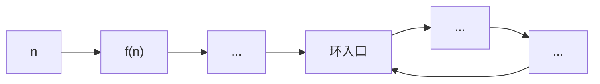
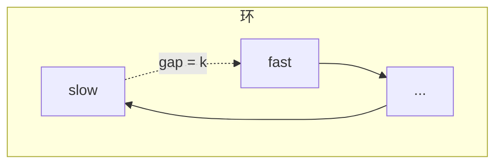
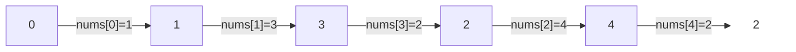

做快乐数这道题的时候，第一反应是——怎么判断会不会无限循环？想了一会没头绪，看完题解才发现，这题的核心根本不是数学，是**判环**。

---

## 一、题目

> 对于一个正整数，每次将它替换为各位数字的平方和，重复这个过程。如果最终能变成 1，就是快乐数；否则会陷入无限循环。

比如 19：$1^2 + 9^2 = 82 → 8^2 + 2^2 = 68 → ... → 1$，是快乐数。

问题在于：你怎么知道它会不会一直算下去停不了？

---

## 二、为什么一定会成环

这是第一个要想清楚的事：**这个序列不可能无限发散**。

`int` 范围内最大是 $2^{31}-1$，10 位数。每位最大是 9，所以平方和的上界是 $9^2 \times 10 = 810$。

也就是说，不管 n 有多大，**一步之后值就落到 [1, 810] 以内了**。从第二步开始，永远在这 810 个格子里打转。最多走 811 步，必然有某个值重复出现。

而这个过程是确定性的——同一个输入永远产生同一个输出。一旦某个值第二次出现，后续序列和第一次完全一样，环就形成了。

所以问题变成了：**这条链会走到 1，还是走进一个不包含 1 的环？**

画出来就是一个 ρ（rho）形结构——一条尾巴接上一个环：



快乐数走到 1 就停了（1 → 1 是自环）；不快乐的数会走进一个不包含 1 的环里死循环。

---

## 三、方法一：哈希表

最直观的做法：用 `unordered_set` 记录见过的数。每算出一个新值，查表里有没有：

- 算出 1 → 快乐数
- 算出一个已有的值 → 环，不是快乐数

简单粗暴，空间 $O(k)$（k 是环的长度加尾巴长度）。

---

## 四、方法二：Floyd 判环（快慢指针）

但其实你仔细想，这个问题和「链表判环」完全一样：

| 链表判环 | 快乐数判环 |
|:---|:---|
| 节点 | 数字 |
| `node->next` | `getSum(n)` |
| 链表有环 → 快慢指针相遇 | 序列有环 → 快慢指针相遇 |
| 链表无环 → fast 到 null | 序列收敛 → fast 到 1 |

不需要额外空间，只用两个变量：慢指针每次走一步，快指针每次走两步。

### 为什么一定能相遇？

当 slow 进入环后，假设两者相距 k 步。每轮 fast 比 slow 多走 1 步，所以距离从 k 变为 k-1, k-2, ..., 1, 0。



每走一轮，gap 减 1。差值**连续递减**，必然经过 0——所以一定相遇。

这就是 Floyd 判环的核心直觉：不需要知道环在哪、有多长，只要快慢指针同时跑，有环就一定撞上。

---

## 五、代码

```cpp
class Solution {
public:
    int getSum(int n) {
        int sum = 0;
        while (n) {
            int d = n % 10;
            sum = sum + d * d;
            n = n / 10;
        }
        return sum;
    }

    bool isHappy(int n) {
        int slow = n;
        int fast = n;
        do {
            slow = getSum(slow);
            fast = getSum(getSum(fast));
        } while (fast != 1 && slow != fast);

        return fast == 1;
    }
};
```

用 `do-while` 而不是 `while`，是因为 slow 和 fast 初始值相同，用 `while` 的话第一轮就退出了。

### 复杂度

- 时间：$O(\log N)$——每次 `getSum` 是 $O(\log N)$（取各位），而序列长度被 810 封顶，所以总体 $O(\log N)$
- 空间：$O(1)$——只用了两个变量

---

## 六、Floyd 判环的更多用途

Floyd 判环不只是快乐数和链表的专属。任何满足下面条件的场景都能用：

1. 有一个确定性的状态转移函数 $f(x)$
2. 状态空间有限（所以一定成环）
3. 你想知道：会不会进入某个状态 / 环的入口在哪 / 环有多长

本质上 Floyd 判环就一句话：**有限状态 + 确定性转移 = 必然成环，快慢指针 = 不用额外空间就能检测环**。

---

## 七、实战：287. 寻找重复数字

[287. 寻找重复数字](https://leetcode.cn/problems/find-the-duplicate-number/)

> 给定一个包含 n+1 个整数的数组 nums，每个整数都在 [1, n] 范围内。证明至少存在一个重复的数字，找出这个重复数。
>
> 要求：不能修改数组，空间 O(1)。

### 关键一步：把数组变成链表

这题最难理解的地方就在这：**数组怎么就变成链表了？**

把数组下标当节点，`nums[i]` 当 next 指针。也就是说，站在下标 `i`，下一步跳到下标 `nums[i]`：

$$f(i) = nums[i]$$

用一个具体例子看。`nums = [1, 3, 4, 2, 2]`：

| 下标 | 0 | 1 | 2 | 3 | 4 |
|:---:|:---:|:---:|:---:|:---:|:---:|
| 值 | 1 | 3 | 4 | 2 | 2 |

从下标 0 开始跳：



写成序列：**0 → 1 → 3 → 2 → 4 → 2 → 4 → 2 → ...**

看到了吗？2 → 4 → 2 → 4 形成了环，而**环的入口就是 2——正好是重复的那个数**。

### 为什么重复数一定是环的入口

想清楚这两件事：

**第一，为什么一定有环？** 值域是 [1, n]，所以从任何节点跳出去都会落到下标 1~n，永远不会回到 0。5 个坑位（1~4）被 5 个值填，鸽巢原理，至少有一个下标被指向两次——两条边指向同一个节点，就是环。

**第二，为什么入口就是重复数？** 假设重复的数是 `x`，那数组里至少有两个位置 `i` 和 `j` 满足 `nums[i] = nums[j] = x`。也就是说，从 `i` 和 `j` 出发都会跳到下标 `x`——**两条路汇聚到 `x`**，`x` 就是环的入口。

### 两阶段 Floyd

快乐数那题只需要判断"有没有环"。但这题需要找**环的入口**——Floyd 算法的完整版分两个阶段。

**阶段一：找到相遇点。** 和之前一样，快指针每次走两步，慢指针每次走一步，在环内相遇。

**阶段二：找环的入口。** 相遇后，把其中一个指针拉回起点，然后两个指针都**一步一步走**，再次相遇的地方就是环入口。

### 阶段二为什么有效

设起点到环入口的距离为 $\mu$，环入口到相遇点的距离为 $k$，环长为 $\lambda$。

相遇时，慢指针走了 $\mu + k$ 步，快指针走了 $2(\mu + k)$ 步。快指针比慢指针多走了若干整圈：

$$2(\mu + k) - (\mu + k) = n\lambda$$
$$\mu + k = n\lambda$$
$$\mu = n\lambda - k$$

这说明什么？从**起点**走 $\mu$ 步到达环入口。从**相遇点**走 $\mu$ 步，等于走 $n\lambda - k$ 步——先走 $\lambda - k$ 步回到环入口，再绕 $n-1$ 圈回到环入口。

**两边走相同的步数，都停在环入口。** 所以让一个指针从起点出发、一个从相遇点出发，同速前进，相遇的地方就是环入口。

### 代码

```cpp
class Solution {
public:
    int findDuplicate(vector<int>& nums) {
        // 阶段一：快慢指针找相遇点
        int slow = 0, fast = 0;
        do {
            slow = nums[slow];
            fast = nums[nums[fast]];
        } while (slow != fast);

        // 阶段二：一个回起点，同速走，找入口
        fast = 0;
        while (slow != fast) {
            slow = nums[slow];
            fast = nums[fast];
        }
        return slow;
    }
};
```

### 复杂度

- 时间：$O(n)$
- 空间：$O(1)$——没用哈希表，没改数组
