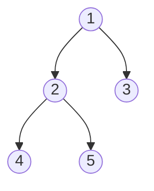
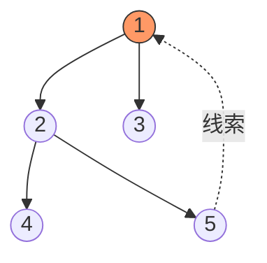
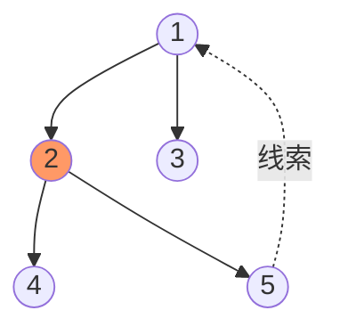
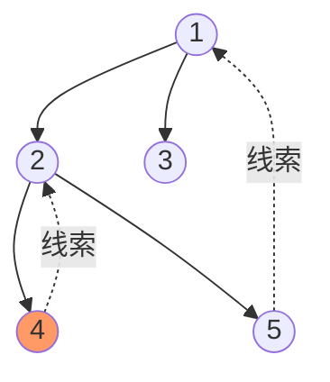
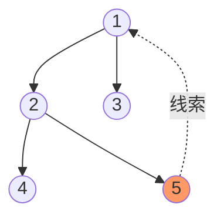
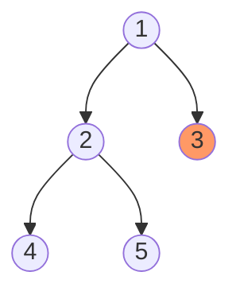
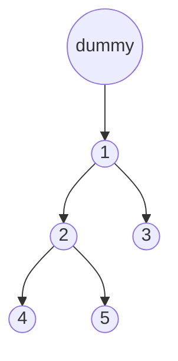
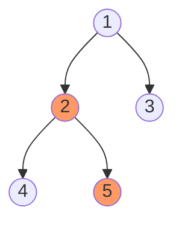
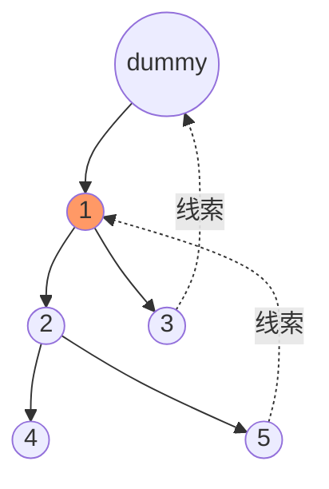

递归遍历二叉树谁都会写，但面试官追问"能不能不用栈、不用递归、O(1) 空间？"，Morris 遍历就是答案。

第一次看 Morris 觉得很魔幻——怎么能修改树结构还能恢复？其实核心思想就一句话：**把空闲的 right 指针当面包屑，走过去之后还能找回来。**

本文用一棵树从头到尾跑一遍 Morris 的中序、前序、后序，每一步都画图。

---

全文用这棵树举例：



---

## 一、问题：回不去了

中序遍历是"左-根-右"。站在节点 1，你得先往左走到 2，再往左走到 4。访问完 4 之后，你需要**回到 2**。

递归靠函数调用栈记住回去的路。迭代靠显式栈。两者都要 O(h) 空间。

**Morris 的思路是：走之前，先在左子树里留一条线索（thread），让你将来能沿着这条线索走回来。**

---

## 二、线索怎么留

从节点 cur 往左走之前，找到左子树里**中序遍历的最后一个节点**——也就是左子树的最右节点（inorder predecessor）。

为什么找它？因为中序遍历中，这个节点访问完之后，下一个该访问的就是 cur。如果这个最右节点的 right 指针是空的（本来就没右孩子），我们可以**临时让它指向 cur**：



节点 5 是节点 1 左子树的最右节点。正常情况下 5 的 right 是 NULL，这里我们临时把它指向 1。这样将来访问完 5 之后，顺着 right 就能回到 1。

---

## 三、两种状态的判定

站在 cur，找到左子树的最右节点 pred 后，有两种情况：

| pred->right | 含义 | 操作 |
|:---:|:---|:---|
| NULL | **第一次到 cur**，还没往左走过 | 建线索：pred->right = cur，cur 往左走 |
| == cur | **第二次到 cur**，左子树已遍历完 | 拆线索：pred->right = NULL，恢复树结构 |

这就是 Morris 遍历的全部机制。没有左子树的节点不需要线索，直接处理后往右走。

---

## 四、Morris 中序遍历：完整模拟

中序是"左-根-右"，所以**第二次到达 cur 时才访问**（左子树处理完了才轮到根）。

### 规则

1. cur 没有左子树 → **访问 cur**，cur = cur->right
2. cur 有左子树 → 找 pred（左子树最右节点）
   - pred->right == NULL → 建线索，cur = cur->left
   - pred->right == cur → 拆线索，**访问 cur**，cur = cur->right

### 逐步模拟

**第 1 步：cur = 1**

有左子树。找 pred：从 2 一路往右到 5，5->right 是 NULL → 第一次到达。

建线索 5→1，cur 往左走到 2。



**第 2 步：cur = 2**

有左子树。找 pred：4，4->right 是 NULL → 第一次到达。

建线索 4→2，cur 往左走到 4。



**第 3 步：cur = 4**

没有左子树 → **访问 4**，cur = cur->right = 2（沿线索回去！）

输出：**[4]**

**第 4 步：cur = 2**

有左子树。找 pred：4，4->right == 2 == cur → **第二次到达**。

拆线索 4->right = NULL，**访问 2**，cur = cur->right = 5。



输出：**[4, 2]**

**第 5 步：cur = 5**

没有左子树 → **访问 5**，cur = cur->right = 1（沿线索回去！）

输出：**[4, 2, 5]**

**第 6 步：cur = 1**

有左子树。找 pred：从 2 一路往右到 5，5->right == 1 == cur → **第二次到达**。

拆线索 5->right = NULL，**访问 1**，cur = cur->right = 3。



输出：**[4, 2, 5, 1]**——树结构已完全恢复！

**第 7 步：cur = 3**

没有左子树 → **访问 3**，cur = cur->right = NULL。结束。

输出：**[4, 2, 5, 1, 3]** ✓

### 代码

```cpp
class Solution {
public:
    vector<int> inorderTraversal(TreeNode* root) {
        vector<int> res;
        TreeNode* cur = root;
        while (cur) {
            if (!cur->left) {
                // 没有左子树，直接访问，往右走
                res.push_back(cur->val);
                cur = cur->right;
            } else {
                // 找左子树的最右节点（predecessor）
                TreeNode* pred = cur->left;
                while (pred->right && pred->right != cur) {
                    pred = pred->right;
                }
                if (!pred->right) {
                    // 第一次到达：建线索，往左走
                    pred->right = cur;
                    cur = cur->left;
                } else {
                    // 第二次到达：拆线索，访问，往右走
                    pred->right = nullptr;
                    res.push_back(cur->val);
                    cur = cur->right;
                }
            }
        }
        return res;
    }
};
```

### 时间复杂度

看起来找 pred 的 while 会让复杂度变成 $O(n^2)$？其实不会。每条边最多被"找 pred"走两次（建线索走一次、拆线索走一次），整棵树一共 n-1 条边，所以总的 pred 查找开销是 $O(n)$。总时间 $O(n)$，空间 $O(1)$。

---

## 五、Morris 前序遍历：改一行

前序是"根-左-右"，所以**第一次到达 cur 就访问**（根先于左子树）。

和中序的唯一区别：**访问时机从"拆线索时"挪到"建线索时"。**

| | 没有左子树 | 第一次到达（建线索） | 第二次到达（拆线索） |
|:---:|:---:|:---:|:---:|
| 中序 | 访问 | — | 访问 |
| **前序** | 访问 | **访问** | — |

### 用同一棵树跑一遍

| 步骤 | cur | 动作 | 输出 |
|:---:|:---:|:---|:---|
| 1 | 1 | 建线索 5→1，**访问 1**，往左 | [1] |
| 2 | 2 | 建线索 4→2，**访问 2**，往左 | [1, 2] |
| 3 | 4 | 无左子树，**访问 4**，沿线索到 2 | [1, 2, 4] |
| 4 | 2 | 拆线索，往右到 5 | |
| 5 | 5 | 无左子树，**访问 5**，沿线索到 1 | [1, 2, 4, 5] |
| 6 | 1 | 拆线索，往右到 3 | |
| 7 | 3 | 无左子树，**访问 3** | [1, 2, 4, 5, 3] ✓ |

### 代码

```cpp
class Solution {
public:
    vector<int> preorderTraversal(TreeNode* root) {
        vector<int> res;
        TreeNode* cur = root;
        while (cur) {
            if (!cur->left) {
                res.push_back(cur->val);
                cur = cur->right;
            } else {
                TreeNode* pred = cur->left;
                while (pred->right && pred->right != cur) {
                    pred = pred->right;
                }
                if (!pred->right) {
                    res.push_back(cur->val);  // ← 区别在这：建线索时就访问
                    pred->right = cur;
                    cur = cur->left;
                } else {
                    pred->right = nullptr;
                    // 中序这里有 push_back，前序没有
                    cur = cur->right;
                }
            }
        }
        return res;
    }
};
```

和中序代码只差一个 `push_back` 的位置。

---

## 六、Morris 后序遍历：逆序右边界

后序是"左-右-根"，根最后才访问。这就麻烦了——Morris 的线索机制是围绕"左子树的最右节点"设计的，没有直接给后序留接口。

### 思路

加一个 **dummy 节点**作为虚拟根，让 dummy->left = root：



然后用和中序一样的线索机制，但在**拆线索时**，不是访问 cur，而是**逆序输出从 cur->left 到 pred 这条"右边界"上的所有节点**。

### 什么是"右边界"

从某个节点开始，沿 right 指针一直走到底的那条链。



节点 1 的左子树的右边界就是 **2 → 5**。拆线索时，逆序输出为 **[5, 2]**。

### 为什么逆序右边界能得到后序

后序是"左-右-根"。每次拆线索时逆序输出一段右边界，刚好覆盖整棵树：

| 拆线索时的 cur | 右边界（cur->left 到 pred） | 逆序输出 |
|:---:|:---|:---|
| 2 | 4 | [4] |
| 1 | 2 → 5 | [5, 2] |
| dummy | 1 → 3 | [3, 1] |

拼起来：**[4, 5, 2, 3, 1]** ✓

### 逐步模拟

| 步骤 | cur | 动作 | 输出 |
|:---:|:---:|:---|:---|
| 1 | dummy | 建线索 3→dummy，往左到 1 | |
| 2 | 1 | 建线索 5→1，往左到 2 | |
| 3 | 2 | 建线索 4→2，往左到 4 | |
| 4 | 4 | 无左子树，沿线索到 2 | |
| 5 | 2 | 拆线索，逆序右边界 [4] | [4] |
| 6 | 5 | 无左子树，沿线索到 1 | |
| 7 | 1 | 拆线索，逆序右边界 [2→5] → [5, 2] | [4, 5, 2] |
| 8 | 3 | 无左子树，沿线索到 dummy | |
| 9 | dummy | 拆线索，逆序右边界 [1→3] → [3, 1] | [4, 5, 2, 3, 1] ✓ |

用图看第 7 步（最关键的一步）。拆线索前，树长这样：



cur = 1，检测到 5→1 是线索 → 拆掉，逆序输出 1->left (2) 到 pred (5) 的右边界：**2 → 5**，逆序为 **[5, 2]**。

### 代码

```cpp
class Solution {
public:
    vector<int> postorderTraversal(TreeNode* root) {
        vector<int> res;
        TreeNode dummy;
        dummy.left = root;
        dummy.right = nullptr;
        TreeNode* cur = &dummy;

        while (cur) {
            if (!cur->left) {
                cur = cur->right;
            } else {
                TreeNode* pred = cur->left;
                while (pred->right && pred->right != cur) {
                    pred = pred->right;
                }
                if (!pred->right) {
                    pred->right = cur;
                    cur = cur->left;
                } else {
                    // 拆线索，逆序输出右边界
                    addReversedRightEdge(cur->left, pred, res);
                    pred->right = nullptr;
                    cur = cur->right;
                }
            }
        }
        return res;
    }

private:
    // 逆序输出从 from 到 to 沿 right 走的路径
    void addReversedRightEdge(TreeNode* from, TreeNode* to, vector<int>& res) {
        vector<int> tmp;
        TreeNode* node = from;
        while (node != to) {
            tmp.push_back(node->val);
            node = node->right;
        }
        tmp.push_back(to->val);
        for (int i = tmp.size() - 1; i >= 0; i--) {
            res.push_back(tmp[i]);
        }
    }
};
```

> `addReversedRightEdge` 用了一个临时数组来逆序，严格来说不是 O(1) 空间。真正的 O(1) 做法是像反转链表一样反转 right 指针、遍历、再反转回来——原理一样，面试中一般不要求。

---

## 七、总结

| | 时间 | 空间 | 访问时机 |
|:---:|:---:|:---:|:---|
| Morris 中序 | O(n) | O(1) | **拆线索时**访问 |
| Morris 前序 | O(n) | O(1) | **建线索时**访问 |
| Morris 后序 | O(n) | O(1) | 拆线索时**逆序输出右边界** |

三种遍历用的是同一套线索机制，区别只在于**什么时候输出、输出什么**。

Morris 遍历的本质就是**利用叶节点空闲的 right 指针作为返回路标**。建线索时留下面包屑，拆线索时沿着面包屑回来，整棵树遍历完后结构完全恢复——从外面看就像什么都没发生过。
