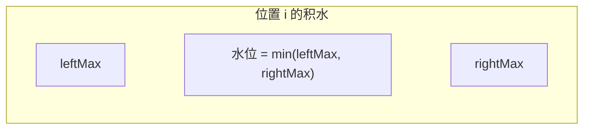
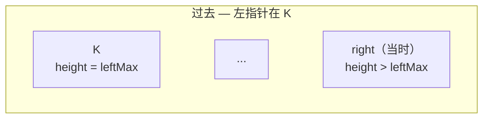
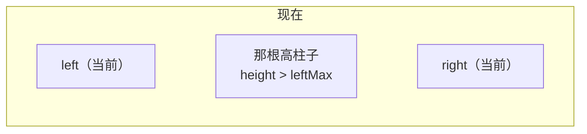
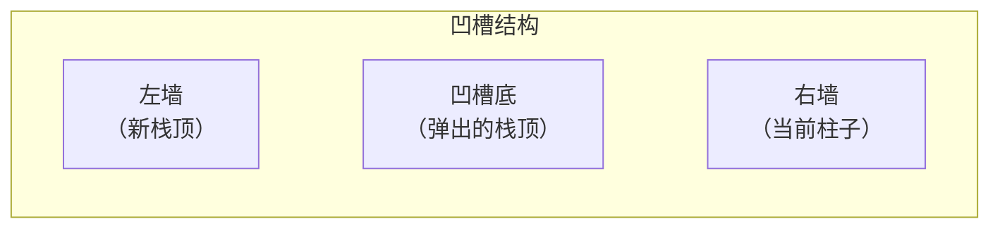
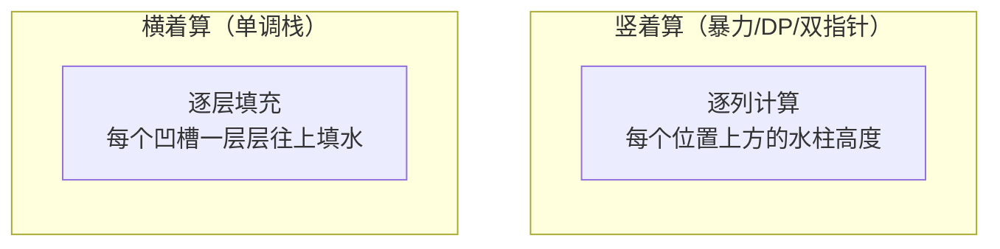
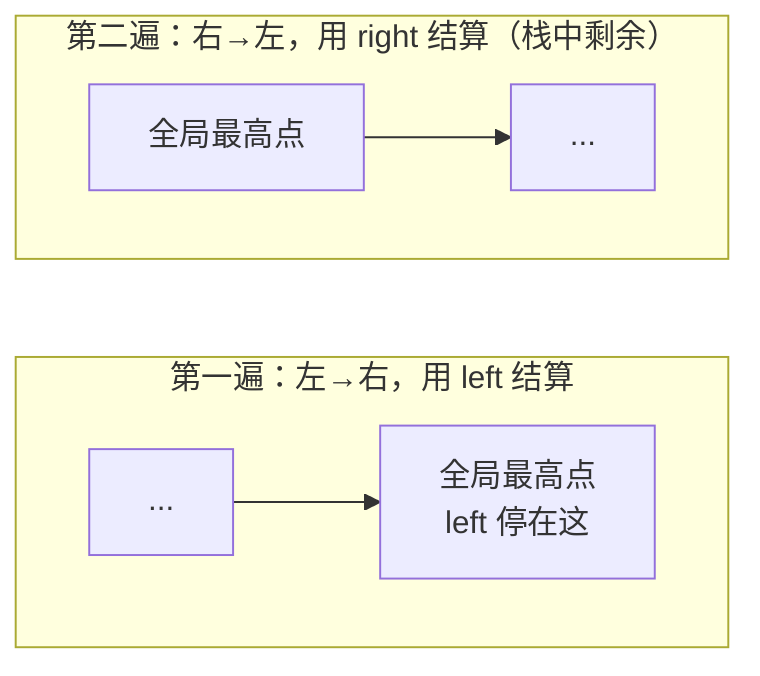

[42. 接雨水](https://leetcode.cn/problems/trapping-rain-water/)

接雨水的代码不难写，但"为什么双指针能用历史最大值直接结算"这个问题，我和自己较劲了很久。网上大部分题解只说"比较两边高度，走矮的那边"，但**为什么走矮的那边用它的 max 结算就一定是对的**，很少有人说清楚。

这篇文章从暴力开始，一步步优化到双指针，把证明过程完整写出来。最后再用单调栈换一个完全不同的视角。

---

## 一、每个位置能接多少水

先抛开所有技巧，想一个最基本的问题：**位置 i 能接多少水？**

水的高度取决于左右两边最高的柱子中**矮的那根**（短板效应），减去当前柱子自身的高度：

$$water[i] = \min(leftMax_i,\ rightMax_i) - height[i]$$

其中 $leftMax_i$ 是 i 左边（含 i）的最高柱子，$rightMax_i$ 是 i 右边（含 i）的最高柱子。



这个公式就是整道题的基础。四种解法的区别只在于**怎么高效地算出每个位置的 leftMax 和 rightMax**。

---

## 二、暴力：每个位置都扫一遍

最直接的做法：对每个位置 i，往左扫一遍找 leftMax，往右扫一遍找 rightMax。

```cpp
class Solution {
public:
    int trap(vector<int>& height) {
        int n = height.size(), ans = 0;
        for (int i = 0; i < n; i++) {
            int leftMax = 0, rightMax = 0;
            for (int j = 0; j <= i; j++) leftMax = max(leftMax, height[j]);
            for (int j = i; j < n; j++) rightMax = max(rightMax, height[j]);
            ans += min(leftMax, rightMax) - height[i];
        }
        return ans;
    }
};
```

- 时间：$O(n^2)$——每个位置都要扫两遍
- 空间：$O(1)$

正确但太慢。问题出在哪？**每个位置都重复扫描了大量重叠区间。**

---

## 三、DP 预处理：空间换时间

既然每次都在反复算 leftMax 和 rightMax，不如**提前算好存起来**。

- `leftMax[i]`：从左往右扫，`leftMax[i] = max(leftMax[i-1], height[i])`
- `rightMax[i]`：从右往左扫，`rightMax[i] = max(rightMax[i+1], height[i])`

```cpp
class Solution {
public:
    int trap(vector<int>& height) {
        int n = height.size(), ans = 0;
        vector<int> leftMax(n), rightMax(n);

        leftMax[0] = height[0];
        for (int i = 1; i < n; i++)
            leftMax[i] = max(leftMax[i - 1], height[i]);

        rightMax[n - 1] = height[n - 1];
        for (int i = n - 2; i >= 0; i--)
            rightMax[i] = max(rightMax[i + 1], height[i]);

        for (int i = 0; i < n; i++)
            ans += min(leftMax[i], rightMax[i]) - height[i];

        return ans;
    }
};
```

- 时间：$O(n)$
- 空间：$O(n)$——两个数组

能不能把空间也干掉？

---

## 四、双指针：O(1) 空间

### 做法

左右各一个指针，各自维护一个历史最大值：

```cpp
class Solution {
public:
    int trap(vector<int>& height) {
        int left = 0, right = height.size() - 1;
        int leftMax = 0, rightMax = 0;
        int ans = 0;

        while (left < right) {
            leftMax = max(leftMax, height[left]);
            rightMax = max(rightMax, height[right]);

            if (height[left] < height[right]) {
                ans += leftMax - height[left];
                left++;
            } else {
                ans += rightMax - height[right];
                right--;
            }
        }
        return ans;
    }
};
```

- 时间：$O(n)$
- 空间：$O(1)$

代码很短。但为什么这样做是对的？

### 直觉上的困惑

走左边时，我用 `leftMax - height[left]` 结算。但正确公式是 `min(leftMax, rightMax) - height[left]`——我怎么知道 `leftMax` 就是那个 `min`？我又没看完右边所有柱子，`rightMax` 只记录了右指针走过的部分，不是右边的真实最大值。

**这才是这道题真正难的地方。**

### 严格证明：历史轨迹论证

我们要证明：**当代码走左边（`height[left] < height[right]`）时，右边的真实最大值一定 ≥ leftMax，所以 `min(leftMax, 真实rightMax) = leftMax`。**

关键在于追溯 `leftMax` 是怎么来的。

`leftMax` 一定是在过去某一步，由左边某根柱子 K 更新的（`leftMax = height[K]`）。

**回到左指针刚好指着 K 的那一刻。** 当时代码执行了比较：`height[K]` vs `height[right当时]`。既然左指针后来能跨过 K 继续往右走，说明当时必然满足：

$$height[K] < height[right_{当时}]$$

否则代码会走右边，左指针不会动。



这句话就是破局的关键：**K 的右边存在一根柱子，高度严格大于 leftMax。**

现在回到当前时刻，左指针在 K 的右边某处，右指针可能还在原位也可能往左移了。但只要左右指针还没相遇，当初那根比 leftMax 高的柱子就**一定还在当前左指针的右边**（因为右指针是从右往左走的，就算经过了它，它也在左指针的右侧）。



既然左指针右边客观存在一根比 leftMax 高的柱子，那么右边的**真实最大值**一定 ≥ 那根柱子 > leftMax。

$$rightMax_{真实} \geq height[那根柱子] > leftMax$$

所以：

$$\min(leftMax,\ rightMax_{真实}) = leftMax$$

用 `leftMax - height[left]` 结算，和完整公式的结果**完全一致**。

右边走的时候，把 left/right 对调，证明一模一样。

### 一句话总结

> **双指针能走到当前的局面，本身就是一种历史筛选——它用移动轨迹默默保证了：当前在走的那一边，其历史最大值一定是两边最大值中较小的那个。**

如果 leftMax 大到能成为全局天花板，当初左指针根本走不动——早就换右指针走了，rightMax 会被拉高。这个"走不动就换边"的机制，就是正确性的根源。

---

## 五、单调栈：换一个视角

前面三种方法都是**竖着算**——逐列计算每个位置上方的积水。单调栈的思路是**横着算**——像填坑一样，一层一层地把凹槽填平。

### 核心思想

维护一个**单调递减栈**（栈底到栈顶，高度递减）。遍历每根柱子时：

- 如果当前柱子比栈顶**矮或相等**，说明还在"下坡"或"平地"，不会积水，入栈
- 如果当前柱子比栈顶**高**，说明找到了一个凹槽的右边界，可以开始结算积水



积水的计算：

- **底部** = 弹出的栈顶（凹槽最低点）
- **左墙** = 弹出后的新栈顶
- **右墙** = 当前柱子
- **水的宽度** = 右墙下标 - 左墙下标 - 1
- **水的高度** = min(左墙高度, 右墙高度) - 底部高度
- **积水面积** = 宽度 × 高度

### 用例子走一遍

`height = [0, 1, 0, 2, 1, 0, 1, 3, 2, 1, 2, 1]`

关键的几步：

| i | height[i] | 栈（下标） | 发生了什么 |
|:---:|:---:|:---|:---|
| 0 | 0 | [0] | 入栈 |
| 1 | 1 | [1] | 弹出 0（底=0，无左墙，跳过），1 入栈 |
| 2 | 0 | [1, 2] | 比栈顶矮，入栈 |
| 3 | 2 | [3] | 弹出 2：底=0，左墙=1(h=1)，右墙=3(h=2)，水=min(1,2)-0=1，宽=3-1-1=1，积水 **+1**。弹出 1：底=1，无左墙，跳过。3 入栈 |
| 5 | 0 | [3, 4, 5] | 比栈顶矮，入栈 |
| 6 | 1 | [3, 4, 6] | 弹出 5：底=0，左墙=4(h=1)，右墙=6(h=1)，水=min(1,1)-0=1，宽=6-4-1=1，积水 **+1** |
| 7 | 3 | [7] | 连续弹出，每次结算一层积水，最终积水 **+4** |
| ... | | | 后续类似 |

最终总积水 = 6。

### 代码

```cpp
class Solution {
public:
    int trap(vector<int>& height) {
        int n = height.size(), ans = 0;
        stack<int> st;  // 存下标

        for (int i = 0; i < n; i++) {
            while (!st.empty() && height[i] > height[st.top()]) {
                int bot = st.top();  // 凹槽底部
                st.pop();
                if (st.empty()) break;  // 没有左墙，积不了水
                int left = st.top();    // 左墙
                int w = i - left - 1;
                int h = min(height[left], height[i]) - height[bot];
                ans += w * h;
            }
            st.push(i);
        }
        return ans;
    }
};
```

- 时间：$O(n)$——每个元素最多入栈出栈各一次
- 空间：$O(n)$——栈

### 竖着算 vs 横着算



两种视角算出来的总积水量一样，只是拆分方式不同。

---

## 六、左右劈开法：在最高点自然分割

前面几种方法要么两边同时逼近（双指针），要么横着填坑（单调栈）。还有一种很直觉的思路：**找到全局最高点，左半边从左往右结算，右半边从右往左结算。**

而且不需要显式找最高点——代码自然就把它分开了。

### 思路

**第一遍（左→右）**：维护一个 `left` 记录当前左墙高度。遇到比它矮的就压栈（暂时不知道能积多少水），遇到 ≥ 它的就说明找到了右墙，把栈里的全部清算（水位 = `left`），然后更新 `left`。

因为 `left` 只增不减，第一遍结束时 `left` 就是全局最大值。栈里剩下的是最高点右边那段"下坡"——它们始终没遇到更高的墙，所以没被清算。

**第二遍（右→左）**：从栈顶弹出就是从右往左。对这段下坡反过来处理，用 `right` 当右墙，逻辑一模一样。



### 为什么对

- 最高点**左边**的每个位置：右边一定存在全局最高点，所以 rightMax ≥ leftMax，水位由 leftMax 决定。第一遍用 `left` 结算，正好。
- 最高点**右边**的每个位置：左边有全局最高点，所以 leftMax ≥ rightMax，水位由 rightMax 决定。第二遍用 `right` 结算，也正好。

跟双指针的"历史轨迹论证"本质上是同一个道理：**谁是短板，就用谁结算**。只是双指针在每一步动态判断短板，这个方法把左半和右半分两趟处理。

### 用例子走一遍

`height = [0, 1, 0, 2, 1, 0, 1, 3, 2, 1, 2, 1]`

**第一遍（左→右）：**

| i | height[i] | left | 栈（底→顶） | 动作 | rain |
|:---:|:---:|:---:|:---|:---|:---:|
| 0 | 0 | 0 | [] | 0 ≥ left，清算（栈空），left=0 | 0 |
| 1 | 1 | 1 | [] | 1 ≥ 0，清算（栈空），left=1 | 0 |
| 2 | 0 | 1 | [0] | 0 < 1，压栈 | 0 |
| 3 | 2 | 2 | [] | 2 ≥ 1，清算：1-0=1，left=2 | 1 |
| 4 | 1 | 2 | [1] | 1 < 2，压栈 | 1 |
| 5 | 0 | 2 | [1, 0] | 0 < 2，压栈 | 1 |
| 6 | 1 | 2 | [1, 0, 1] | 1 < 2，压栈 | 1 |
| 7 | 3 | 3 | [] | 3 ≥ 2，清算：2-1+2-0+2-1=5，left=3 | 5 |
| 8 | 2 | 3 | [2] | 2 < 3，压栈 | 5 |
| 9 | 1 | 3 | [2, 1] | 1 < 3，压栈 | 5 |
| 10 | 2 | 3 | [2, 1, 2] | 2 < 3，压栈 | 5 |
| 11 | 1 | 3 | [2, 1, 2, 1] | 1 < 3，压栈 | 5 |

第一遍结束：rain = 5，栈里剩 [2, 1, 2, 1]（最高点右边的下坡）。

**第二遍（从栈顶弹出 = 右→左）：**

| 弹出值 | right | 动作 | rain |
|:---:|:---:|:---|:---:|
| 1 | 1 | 1 ≥ 0，更新 right=1 | 5 |
| 2 | 2 | 2 ≥ 1，更新 right=2 | 5 |
| 1 | 2 | 1 < 2，积水 2-1=1 | 6 |
| 2 | 2 | 2 ≥ 2，更新 right=2 | 6 |

最终 rain = **6** ✓

### 代码

```cpp
class Solution {
public:
    int trap(vector<int>& height) {
        stack<int> wood;
        int left = 0;
        int rain = 0;

        // 第一遍：左→右，用 left 结算
        for (int i = 0; i < height.size(); ++i) {
            if (height[i] < left) {
                wood.push(height[i]);
            } else {
                while (!wood.empty()) {
                    rain += left - wood.top();
                    wood.pop();
                }
                left = height[i];
            }
        }

        // 第二遍：右→左（从栈顶弹出），用 right 结算
        int right = 0;
        while (!wood.empty()) {
            if (wood.top() >= right) {
                right = wood.top();
            } else {
                rain += right - wood.top();
            }
            wood.pop();
        }

        return rain;
    }
};
```

- 时间：$O(n)$
- 空间：$O(n)$——栈

---

## 七、总结

| 方法 | 时间 | 空间 | 思路 |
|:---|:---:|:---:|:---|
| 暴力 | $O(n^2)$ | $O(1)$ | 每个位置扫两遍找 leftMax / rightMax |
| DP 预处理 | $O(n)$ | $O(n)$ | 提前算好 leftMax[] 和 rightMax[] |
| 双指针 | $O(n)$ | $O(1)$ | 历史轨迹保证走的那边 max 一定是较小值 |
| 单调栈 | $O(n)$ | $O(n)$ | 横着填坑，遇到右墙就结算凹槽 |
| 左右劈开 | $O(n)$ | $O(n)$ | 在全局最高点自然分割，左右各结算一趟 |

五种方法的核心公式都是同一个：$water = \min(leftMax, rightMax) - height[i]$。

暴力 → DP 是"空间换时间"的经典优化。DP → 双指针是"用移动方向的选择来隐式确定 min"的巧妙压缩。单调栈换了维度横着拆解。左右劈开法则把"谁是短板"这个问题用最直觉的方式解决——最高点左边，左墙一定是短板；右边，右墙一定是短板。
