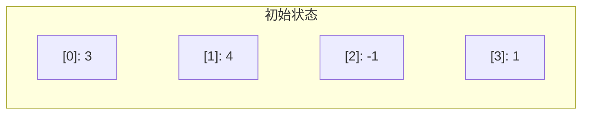
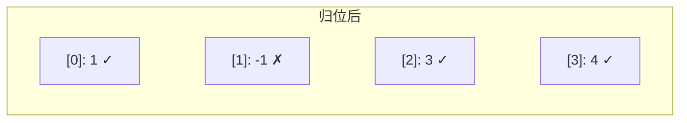
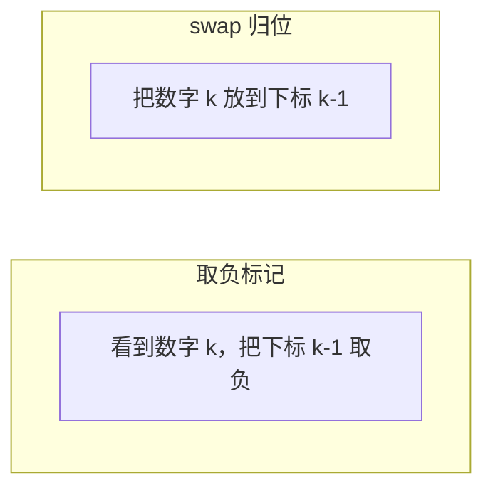

做 [41. 缺失的第一个正数](https://leetcode.cn/problems/first-missing-positive/) 的时候，O(n) 时间很容易，但加上 O(1) 空间的限制就卡住了——不让用哈希表，怎么判断哪个数出现过？

答案是：**数组本身就是一张哈希表。**

这个技巧叫"原地哈希"，核心就一句话：**把数字 k 放到下标 k-1 的位置上。** 放完之后扫一遍，第一个"不在位"的位置就是答案。

---

## 一、LC41：缺失的第一个正数

### 题目

> 给一个未排序的整数数组 nums，找出其中没有出现的最小的正整数。要求 O(n) 时间，O(1) 额外空间。

### 关键观察

数组长度为 n，答案一定在 **[1, n+1]** 之间。

为什么？最好的情况是数组刚好装着 1, 2, 3, ..., n，答案是 n+1。只要有一个数不在这个范围内（比如负数、0、或者 > n 的数），就一定有某个 [1, n] 内的数缺席了。

所以我们只需要关心值在 [1, n] 内的数，其他的全是干扰项。

### 思路：把每个数送回家

建立映射关系：**数字 k 应该住在下标 k-1**。

| 数字 | 应该在的下标 |
|:---:|:---:|
| 1 | 0 |
| 2 | 1 |
| 3 | 2 |
| ... | ... |
| n | n-1 |

遍历数组，对每个数，如果它在 [1, n] 范围内且不在自己该在的位置，就把它**换**到正确的位置。换完之后再检查当前位置的新数字，继续换，直到当前位置的数字要么不在范围内、要么已经在对的位置。

### 用例子走一遍

`nums = [3, 4, -1, 1]`，n = 4。



**i = 0**：nums[0] = 3，应该在下标 2。交换 nums[0] 和 nums[2]：

| 下标 | 0 | 1 | 2 | 3 |
|:---:|:---:|:---:|:---:|:---:|
| 值 | **-1** | 4 | **3** | 1 |

现在 nums[0] = -1，不在 [1, 4] 内，跳过。

**i = 1**：nums[1] = 4，应该在下标 3。交换 nums[1] 和 nums[3]：

| 下标 | 0 | 1 | 2 | 3 |
|:---:|:---:|:---:|:---:|:---:|
| 值 | -1 | **1** | 3 | **4** |

现在 nums[1] = 1，应该在下标 0。交换 nums[1] 和 nums[0]：

| 下标 | 0 | 1 | 2 | 3 |
|:---:|:---:|:---:|:---:|:---:|
| 值 | **1** | **-1** | 3 | 4 |

现在 nums[1] = -1，跳过。

**i = 2**：nums[2] = 3，应该在下标 2，已经就位，跳过。

**i = 3**：nums[3] = 4，应该在下标 3，已经就位，跳过。

最终状态：



扫一遍：下标 1 的值不是 2 → 答案是 **2**。

### 代码

```cpp
class Solution {
public:
    int firstMissingPositive(vector<int>& nums) {
        int n = nums.size();
        for (int i = 0; i < n; i++) {
            // 只要当前数在 [1, n] 且不在该在的位置，就换过去
            while (nums[i] >= 1 && nums[i] <= n
                   && nums[nums[i] - 1] != nums[i]) {
                swap(nums[i], nums[nums[i] - 1]);
            }
        }
        // 扫一遍，第一个不在位的就是答案
        for (int i = 0; i < n; i++) {
            if (nums[i] != i + 1) return i + 1;
        }
        return n + 1;
    }
};
```

### 两个细节

**1. 为什么用 while 不用 if？**

一次 swap 把 nums[i] 送到了正确位置，但换过来的新值可能也需要归位。必须循环处理直到当前位置"稳定"了。

**2. 为什么判断 `nums[nums[i] - 1] != nums[i]` 而不是 `nums[i] != i + 1`？**

如果数组里有重复值（比如 `[1, 1]`），用 `nums[i] != i + 1` 会导致两个相同的值互相换来换去死循环。用 `nums[nums[i] - 1] != nums[i]` 的含义是"目标位置上还不是这个值"，如果目标位置已经有了一样的数，就不换了。

### 时间复杂度

看起来 while 嵌套在 for 里会导致 $O(n^2)$？不会。每次 swap 都让一个数归位，一个数最多被归位一次，所以 swap 总共最多执行 n 次。总时间 $O(n)$，空间 $O(1)$。

---

## 二、原地哈希的模板

抽象一下，原地哈希的套路是：

```
1. 归位：遍历数组，把每个值在合法范围内的数送到它该在的位置
2. 检查：再遍历一遍，找出"不在位"的位置
```

不同题目的区别只在于：

| | 映射关系 | "不在位"意味着什么 |
|:---|:---|:---|
| LC41 | 数字 k → 下标 k-1 | 这个正整数缺失了 |
| LC448 | 数字 k → 下标 k-1 | 这个数字消失了 |
| LC442 | 数字 k → 下标 k-1 | 这个数字出现了两次 |
| LC645 | 数字 k → 下标 k-1 | 找到重复的和缺失的 |

归位的逻辑几乎一模一样，只是最后检查阶段的解读不同。

---

## 三、LC448：找到所有消失的数字

[448. 找到所有数组中消失的数字](https://leetcode.cn/problems/find-all-numbers-disappeared-in-an-array/)

> 给一个长度为 n 的数组，值都在 [1, n] 内，找出 [1, n] 中所有没出现的数字。O(n) 时间，不使用额外空间。

和 LC41 几乎一模一样，只是从"找第一个缺失"变成"找所有缺失"。

```cpp
class Solution {
public:
    vector<int> findDisappearedNumbers(vector<int>& nums) {
        int n = nums.size();
        // 归位
        for (int i = 0; i < n; i++) {
            while (nums[i] >= 1 && nums[i] <= n
                   && nums[nums[i] - 1] != nums[i]) {
                swap(nums[i], nums[nums[i] - 1]);
            }
        }
        // 检查：所有不在位的位置就是消失的数字
        vector<int> res;
        for (int i = 0; i < n; i++) {
            if (nums[i] != i + 1) res.push_back(i + 1);
        }
        return res;
    }
};
```

归位代码一字不差，只改了检查阶段。

---

## 四、LC442：数组中重复的数据

[442. 数组中重复的数据](https://leetcode.cn/problems/find-all-duplicates-in-an-array/)

> 给一个长度为 n 的数组，值在 [1, n] 内，有些数字出现两次，其他出现一次。找出所有出现两次的数字。O(n) 时间，不使用额外空间。

归位之后，出现两次的数会占掉一个位置，导致另一个位置上放着"错误的客人"：

```cpp
class Solution {
public:
    vector<int> findDuplicates(vector<int>& nums) {
        int n = nums.size();
        // 归位
        for (int i = 0; i < n; i++) {
            while (nums[i] >= 1 && nums[i] <= n
                   && nums[nums[i] - 1] != nums[i]) {
                swap(nums[i], nums[nums[i] - 1]);
            }
        }
        // 检查：不在位的位置，当前值就是重复的那个数
        vector<int> res;
        for (int i = 0; i < n; i++) {
            if (nums[i] != i + 1) res.push_back(nums[i]);
        }
        return res;
    }
};
```

和 LC448 的区别：LC448 收集的是 `i + 1`（缺失的数），LC442 收集的是 `nums[i]`（多出来的数）。

想一下为什么：如果下标 2 上放的不是 3 而是 5，说明 5 在别处已经归位了一份，这里多出来一份——5 就是重复的。而 3 没出现在任何位置上——3 就是消失的。**缺失和重复是同一枚硬币的两面。**

---

## 五、LC645：错误的集合

[645. 错误的集合](https://leetcode.cn/problems/set-mismatch/)

> 集合 [1, n] 中有一个数字重复了，导致另一个数字丢失了。找出重复的数和丢失的数。

这道题就是同时要 LC442 的结果和 LC448 的结果：

```cpp
class Solution {
public:
    vector<int> findErrorNums(vector<int>& nums) {
        int n = nums.size();
        // 归位
        for (int i = 0; i < n; i++) {
            while (nums[i] >= 1 && nums[i] <= n
                   && nums[nums[i] - 1] != nums[i]) {
                swap(nums[i], nums[nums[i] - 1]);
            }
        }
        // 找到不在位的位置：nums[i] 是重复的，i+1 是缺失的
        for (int i = 0; i < n; i++) {
            if (nums[i] != i + 1) {
                return {nums[i], i + 1};
            }
        }
        return {};
    }
};
```

---

## 六、另一种原地标记：取负号

有些题不方便做 swap（比如不想改变原数组的相对顺序），可以用另一种原地哈希思路：**用正负号当标记**。

遍历数组，看到数字 k 就把下标 k-1 的值**取负**，表示"k 出现过"。第二遍扫的时候，正数对应的位置就是没出现过的。

以 LC448 为例：

```cpp
class Solution {
public:
    vector<int> findDisappearedNumbers(vector<int>& nums) {
        int n = nums.size();
        // 标记：看到 k，就把 nums[k-1] 变负
        for (int i = 0; i < n; i++) {
            int idx = abs(nums[i]) - 1;  // abs 因为可能已经被标记过
            if (nums[idx] > 0) nums[idx] = -nums[idx];
        }
        // 检查：正数位置对应的数字消失了
        vector<int> res;
        for (int i = 0; i < n; i++) {
            if (nums[i] > 0) res.push_back(i + 1);
        }
        return res;
    }
};
```



两种方式本质一样：都是把数组本身当哈希表，用**下标**做 key，用**值是否就位 / 是否为负**做 value。swap 更直观，取负不改变相对顺序。

---

## 七、什么时候能用原地哈希

原地哈希有一个硬前提：

> **值域和下标域要能建立一一映射。**

具体来说，需要满足：
1. 值域有界，且范围大致等于数组长度（比如 [1, n] 映射到 [0, n-1]）
2. 题目允许修改原数组（或者用取负这种可恢复的方式）
3. 要求 O(1) 额外空间

看到"长度为 n，值在 [1, n] 范围内"这类条件，就该想到原地哈希。

### 适用题目速查

| 题目 | 核心问题 | 归位后检查什么 |
|:---|:---|:---|
| [41. 缺失的第一个正数](https://leetcode.cn/problems/first-missing-positive/) | 最小缺失正整数 | 第一个 nums[i] ≠ i+1 |
| [448. 消失的数字](https://leetcode.cn/problems/find-all-numbers-disappeared-in-an-array/) | 所有缺失的数 | 所有 nums[i] ≠ i+1 的 i+1 |
| [442. 重复的数据](https://leetcode.cn/problems/find-all-duplicates-in-an-array/) | 所有重复的数 | 所有 nums[i] ≠ i+1 的 nums[i] |
| [645. 错误的集合](https://leetcode.cn/problems/set-mismatch/) | 重复 + 缺失 | nums[i] 是重复，i+1 是缺失 |
| [268. 丢失的数字](https://leetcode.cn/problems/missing-number/) | [0,n] 中缺失的数 | 归位后不在位的位置（也可用异或/求和） |
