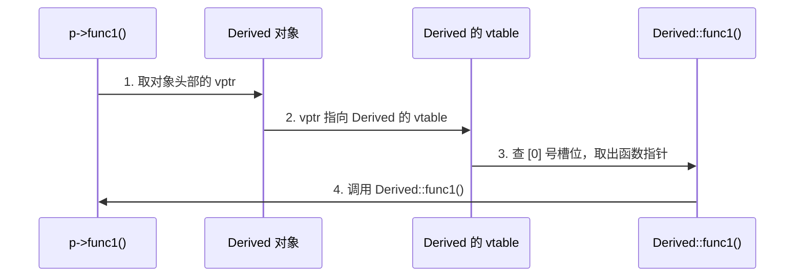

背八股的时候看到"虚表""虚指针"这些词，总觉得似懂非懂——知道有这么个东西，但它到底长什么样、存在哪里、什么时候被设置，说不清楚。

这篇文章用一个例子把整个机制从头到尾拆一遍。

---

## 一、问题：多态为什么失败了

```cpp
class Animal {
public:
    void speak() { cout << "..." << endl; }
};

class Dog : public Animal {
public:
    void speak() { cout << "汪汪" << endl; }
};

Animal* p = new Dog();
p->speak();  // 输出 "..." 而不是 "汪汪"
```

`p` 明明指向一个 `Dog` 对象，却调用了 `Animal::speak()`。因为编译器看到 `p` 的类型是 `Animal*`，在**编译期**就把调用绑定到了 `Animal::speak()`——这叫**静态绑定**。

加上 `virtual` 后，`p->speak()` 就能正确输出 `"汪汪"` 了。编译器把决定推迟到运行时，根据对象的实际类型选择函数——这叫**动态绑定**，也就是多态。

那运行时怎么知道该调哪个版本？这个机制由三部分组成：**虚表、虚指针、构造时的设置**。它们是一个整体，下面一次性讲完。

---

## 二、完整机制：虚表 + 虚指针 + 对象布局

### 用一个例子贯穿

后面全文都用这个例子：

```cpp
class Base {
public:
    int x;
    virtual void func1();
    virtual void func2();
    virtual void func3();
};

class Derived : public Base {
public:
    int y;
    void func1() override;  // 重写
    void func3() override;  // 重写
    // func2 没有重写
};
```

### 第一件事：编译器给每个类生成一张虚表

虚表（vtable）就是一个函数指针数组，按声明顺序排列。**每个类一张**，编译期生成，存在只读数据段（`.rodata`）。

| 槽位 | Base 的 vtable | Derived 的 vtable | 变化 |
|:---:|:---|:---|:---:|
| [0] | `&Base::func1` | `&Derived::func1` | 重写 |
| [1] | `&Base::func2` | `&Base::func2` | 继承 |
| [2] | `&Base::func3` | `&Derived::func3` | 重写 |

Derived 的 vtable 是在 Base 的基础上"打补丁"——重写了哪个就替换哪个槽位，没重写的原样保留。

### 第二件事：每个对象头部藏了一个虚指针

虚指针（vptr）是编译器在对象头部偷偷插入的一个指针，指向该对象所属类的 vtable。程序员看不到它，但它真实存在、占用内存。

一个 Base 对象在内存中长这样：

| 偏移 | 内容 |
|:---:|:---|
| 0 | **vptr** → 指向 Base 的 vtable |
| 8 | int x |

一个 Derived 对象在内存中长这样：

| 偏移 | 内容 |
|:---:|:---|
| 0 | **vptr** → 指向 Derived 的 vtable |
| 8 | int x（继承自 Base） |
| 12 | int y（Derived 自己的） |

**这就是整个机制的关键**：不同类的对象，vptr 指向不同的 vtable。同样是调用 `func1()`，Base 对象的 vptr 指向 Base vtable 里的 `&Base::func1`，Derived 对象的 vptr 指向 Derived vtable 里的 `&Derived::func1`。

### 第三件事：vptr 在构造函数中被设置

| 构造阶段 | vptr 指向 |
|:---|:---|
| 执行 Base 的构造函数 | Base 的 vtable |
| 执行 Derived 的构造函数 | Derived 的 vtable（覆盖） |

这就是为什么**不要在构造函数中调用虚函数**——构造 Base 部分时 vptr 还指向 Base 的 vtable，调用虚函数会走到 Base 版本而非 Derived 版本。析构时同理，vptr 会逐层回退。

---

## 三、调用链路：`p->func1()` 到底发生了什么

```cpp
Base* p = new Derived();
p->func1();
```

运行时的四步：



翻译成伪代码：

```cpp
// p->func1() 等价于：
(*(p->vptr)[0])(p);  // vptr[0] 是 func1 的槽位
```

运行时多态的底层机制就是：**一次指针解引用（取 vptr）+ 一次数组下标（查 vtable）+ 一次函数指针调用**。相比静态绑定多了两次间接寻址，这就是虚函数的性能开销。

---

## 四、虚析构函数

```cpp
Base* p = new Derived();
delete p;
```

如果 `Base` 的析构函数不是 `virtual`，`delete p` 只调用 `Base::~Base()`，Derived 部分的资源不会被清理——内存泄漏或未定义行为。

声明为 `virtual` 后，`delete p` 走的是和第三节一模一样的路：取 vptr → 查 vtable → 找到 `Derived::~Derived()` → 先析构 Derived 再析构 Base。

> **规则：只要一个类有虚函数，就应该让析构函数也是虚函数。**

---

## 五、纯虚函数和抽象类

```cpp
class Shape {
public:
    virtual double area() = 0;  // 纯虚函数
    virtual ~Shape() = default;
};
```

`= 0` 表示"没有默认实现，子类必须重写"。含有纯虚函数的类叫**抽象类**，不能实例化。

抽象类的 vtable 中，纯虚函数的槽位填充为 `__cxa_pure_virtual`（GCC），万一运行时调到了会直接报错而非静默崩溃。

---

## 六、多继承：多个 vptr

前面一直是单继承，只有一个 vptr。多继承会复杂一些。

```cpp
class A { virtual void funcA(); };
class B { virtual void funcB(); };

class C : public A, public B {
    void funcA() override;
    void funcB() override;
};
```

多继承时，对象中有**多个 vptr**，每个基类子对象一个。

**C 对象的内存布局：**

| 偏移 | 内容 |
|:---:|:---|
| 0 | **vptr_A** → 指向 A 部分的 vtable |
| 8 | A 的成员 |
| ... | **vptr_B** → 指向 B 部分的 vtable |
| ... | B 的成员 |
| ... | C 自身的成员 |

**A 部分的 vtable：**

| 槽位 | 函数指针 |
|:---:|:---|
| [0] | `&C::funcA` |

**B 部分的 vtable：**

| 槽位 | 函数指针 |
|:---:|:---|
| [0] | `&C::funcB` |

通过 `A*` 调用时，指针指向 vptr_A，用 A 部分的 vtable。通过 `B*` 调用时，编译器把指针调整到 vptr_B 的位置（thunk），用 B 部分的 vtable。

多继承对象 `sizeof` 更大，就是因为多了额外的 vptr。

---

## 七、面试高频追问

**Q：构造函数能是虚函数吗？**
不能。构造函数执行时 vptr 还没正确设置，无法通过 vtable 派发。而且构造必须明确知道要构造什么类型，不存在"多态构造"的需求。

**Q：静态函数能是虚函数吗？**
不能。静态成员函数没有 `this` 指针，不属于任何对象实例，无法通过 vptr 派发。

**Q：虚函数能被内联吗？**
如果编译器能在编译期确定调用目标（比如通过对象而非指针调用、或者 devirtualization 优化），可以内联。但通过基类指针的多态调用通常无法内联。

**Q：虚函数的性能开销到底有多大？**
两方面：一是每次调用多两次间接寻址（取 vptr + 查 vtable），几纳秒；二是无法内联，编译器失去了内联展开、常量传播等优化机会——这才是更大的影响。

**Q：vptr 占多大？**
一个指针。64位系统8字节。一个空的含虚函数的类 `sizeof` 为 8 而非 1。
