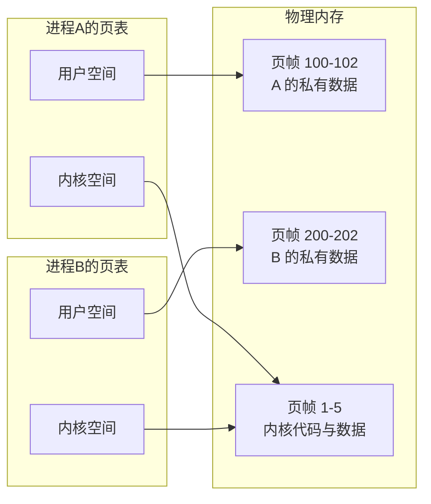
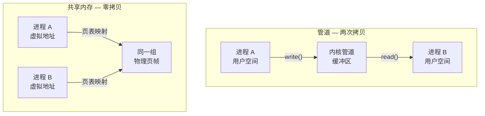
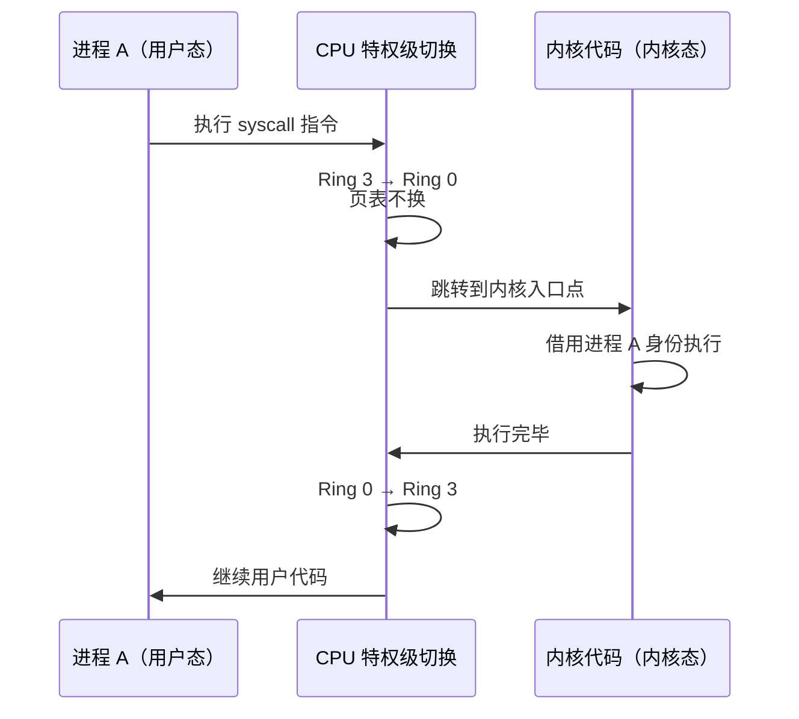

背操作系统八股的时候，我先是记住了"用户态和内核态有区别"。好，记住了。然后继续背 IPC，看到"管道是内核中的一个缓冲区"，"消息队列是内核中的链表"，"共享内存是把虚拟地址映射到同一块物理内存"——等等，**内核到底在哪？** 它是个什么东西？它存在于内存的什么位置？"内核中的缓冲区"到底是什么意思？

我发现我背了一堆结论，但根本不理解这些话在物理层面到底在说什么。

于是我开始拷打Claude，从虚拟内存开始，一路往下追问，打破了我一直以来的认知：**操作系统不是一个实时运行的程序，而是一套静态的基础设施，被无数次触发执行拼出了"持续运行"的假象。**

这篇文章就是把这个追问过程整理出来。

---

## 一、从加电开始：一台机器是怎么醒过来的

要搞清楚内核在哪，得先搞清楚它是怎么来的。从机器加电那一刻开始看。

### CPU 的第一条指令

机器通电后，CPU 从一个硬编码的物理地址开始执行。在 x86 上，这个地址是 `0xFFFFFFF0`——4GB 地址空间顶端往下 16 字节的位置（[Intel SDM Vol.3A, Ch.9](https://cdrdv2-public.intel.com/825758/253668-sdm-vol-3a.pdf)）。

注意，此时什么都没有。没有虚拟内存，没有操作系统，没有进程。CPU 就是在物理地址上裸奔。

### 固件与引导

`0xFFFFFFF0` 处映射的是主板上的固件——BIOS 或 UEFI。固件先做硬件自检（POST），确认内存条能用、磁盘在不在，然后从磁盘上找到引导程序（Bootloader，比如 GRUB），加载到内存里，跳过去执行（[OSDev Wiki: Boot Sequence](https://wiki.osdev.org/Boot_Sequence)）。

### 加载内核

GRUB 拿到控制权后，根据配置文件找到内核映像文件（`vmlinuz`），把它从磁盘搬到物理内存中（[Linux Boot Protocol](https://docs.kernel.org/arch/x86/boot.html)）。

这里有个有趣的鸡生蛋问题：内核需要磁盘驱动才能读磁盘上的根文件系统，但磁盘驱动本身可能就在那个根文件系统里。怎么办？答案是 `initramfs`——一个临时的内存文件系统，和内核一起被加载到内存，里面塞了启动早期需要的驱动。内核先用 initramfs 的驱动访问磁盘，挂载真正的根文件系统后再切过去（[ramfs, rootfs and initramfs](https://docs.kernel.org/filesystems/ramfs-rootfs-initramfs.html)）。

### 内核初始化

内核拿到控制权后开始干活：

1. **建立页表，开启 MMU**——从物理地址模式切换到虚拟地址模式（[Page Table Management](https://www.kernel.org/doc/gorman/html/understand/understand006.html)）
2. **初始化各个子系统**——内存管理、中断控制、驱动程序等
3. **挂载根文件系统**——从 initramfs 切换到磁盘上的 `/`
4. **创建 PID 0（idle 进程）和 PID 1（init/systemd）**

到这里，系统就算启动了。

注意：**内核本体就是磁盘上的一个文件**（通常是 `/boot/vmlinuz-<版本号>`，[Kernel README](https://docs.kernel.org/admin-guide/README.html)），启动时被搬到物理内存里，此后常驻直到关机。运行期间它永远不会被换出（swap）到磁盘——想想也知道，如果内核自己被换出去了，谁来把它换回来？（[Memory Concepts](https://docs.kernel.org/admin-guide/mm/concepts.html)）

---

## 二、虚拟内存：为什么每个进程都以为自己独占了整台机器

刚才说内核初始化时要"建立页表、开启 MMU"。这到底在干什么？要回答这个问题，得先搞清楚物理内存是怎么回事。

### 物理内存就是个大数组

物理内存就是你主板上插的那条内存条（DRAM），没什么神秘的。它本质上是一个巨大的字节数组，每个字节有一个物理地址，从 `0x00000000` 开始编号。

有个细节值得一提：DRAM 每个 bit 用一个微小电容存电荷，有电荷是 1，没电荷是 0。电容会漏电，所以需要每隔几毫秒刷新一次——这就是 "Dynamic" 的由来。**断电了，所有数据就没了。**（[Wikipedia: DRAM](https://en.wikipedia.org/wiki/Dynamic_random-access_memory)）

也就是说，前面提到的那些东西——内核代码、页表、管道缓冲区——全在内存条上，关机就消失。内核本体在磁盘上，下次开机再搬一遍。

### 直接用物理地址会出大问题

如果让程序直接操作物理地址，马上就有三个麻烦：

1. **没有隔离**：进程 A 能随便读写进程 B 的内存，想想就可怕
2. **地址冲突**：每个程序编译时得知道自己加载到哪个物理位置，还不能和别人撞上
3. **碎片化**：进程反复创建销毁后，物理内存变得支离破碎，找不到连续的大块空间

怎么办？加一层抽象：**虚拟内存**。

### 页表和 MMU：地址翻译

操作系统把虚拟地址空间和物理内存都切成 4KB 一块。虚拟的叫**页（page）**，物理的叫**页帧（page frame）**。

每个进程有一张**页表**，说白了就是一张映射表——哪个虚拟页对应哪个物理页帧：

**进程 A 的页表：**

| 虚拟页 | 物理页帧 | 备注 |
|:---:|:---:|:---|
| 虚拟页 0 | 页帧 5 | |
| 虚拟页 1 | 页帧 2 | |
| 虚拟页 2 | 未映射 | 访问触发缺页异常 |

**进程 B 的页表：**

| 虚拟页 | 物理页帧 | 备注 |
|:---:|:---:|:---|
| 虚拟页 0 | 页帧 9 | |
| 虚拟页 1 | 页帧 2 | 和 A 指向同一个物理页帧！ |

CPU 里面有个硬件叫 **MMU（Memory Management Unit）**，每次访问内存时，MMU 自动查页表，把虚拟地址翻译成物理地址，再去内存条上读写。整个过程对进程完全透明——进程压根不知道自己用的是虚拟地址（[Page Tables](https://docs.kernel.org/mm/page_tables.html)）。

MMU 内部还有个缓存叫 **TLB（Translation Lookaside Buffer）**，存最近用过的翻译结果，省得每次都去查多级页表（[Wikipedia: TLB](https://en.wikipedia.org/wiki/Translation_lookaside_buffer)）。

### 内核空间和用户空间：不是两块硬件

以 32 位系统的经典划分为例，每个进程 4GB 的虚拟地址空间被劈成两半（[Process Address Space](https://www.kernel.org/doc/gorman/html/understand/understand007.html)）：

| 地址范围 | 大小 | 区域 |
|:---|:---:|:---|
| `0x00000000` - `0xBFFFFFFF` | 3GB | 用户空间 |
| `0xC0000000` - `0xFFFFFFFF` | 1GB | 内核空间 |

**这里有个很多人搞混的点：内核空间和用户空间都是虚拟地址。** 它们不是两块不同的物理硬件，只是虚拟地址空间的两个区域，各自通过页表映射到物理内存的不同位置。

- **用户空间**：每个进程的映射不同。进程 A 的 `0x08000000` 映射到物理页帧 X，进程 B 的同一地址映射到页帧 Y。这就是进程隔离。
- **内核空间**：所有进程的映射**相同**。不管你在进程 A 还是进程 B，`0xC0000000` 以上都指向**同一组物理页帧**。

那靠什么防止用户程序乱访问内核空间？**CPU 的特权级**。用户态（Ring 3）下 CPU 禁止你碰内核空间的地址，碰了就触发异常。只有通过系统调用切到内核态（Ring 0），CPU 才放行（[Wikipedia: Protection Ring](https://en.wikipedia.org/wiki/Protection_ring)）。

### "所有进程共享同一个内核空间"到底什么意思

这个说法刚看到的时候我也懵了：每个进程不是各有 4GB 吗，怎么内核空间还是"同一个"？

看页表就明白了：

**进程 A 的页表：**

| 区域 | 映射到的物理页帧 | 说明 |
|:---|:---|:---|
| 用户空间 | 页帧 100, 101, 102 ... | A 自己的数据 |
| 内核空间 | 页帧 **1, 2, 3, 4, 5** | 内核 |

**进程 B 的页表：**

| 区域 | 映射到的物理页帧 | 说明 |
|:---|:---|:---|
| 用户空间 | 页帧 200, 201, 202 ... | B 自己的数据 |
| 内核空间 | 页帧 **1, 2, 3, 4, 5** | 内核 |

看到没？用户空间映射到不同的物理页帧，各进程私有。但内核空间映射到**完全相同**的页帧 1、2、3、4、5。

画出来就是这样：

所谓"共享"，就是**每个进程的页表里，内核那部分的映射条目是一样的，都指向同一个地方**。内核只有一份，躺在物理内存里，每个进程的页表里都有一份指向它的"快捷方式"。就像同一个文件被很多快捷方式指向，文件只有一份（[Memory Concepts](https://docs.kernel.org/admin-guide/mm/concepts.html)）。

> 64 位系统的地址空间大得多（48 位寻址下用户空间和内核空间各 128TB），但划分原理一模一样（[x86_64 Memory Management](https://docs.kernel.org/arch/x86/x86_64/mm.html)）。

---

## 三、内核的本质：它不是一个运行中的程序

好了，有了虚拟内存的基础，终于可以回答我一开始的问题了：**内核到底是什么？它在哪？**

### 内核不是一个进程

这是最反直觉的一点。内核没有自己的 PID，没有自己的页表，没有自己的虚拟地址空间。它就是一段代码和数据，常驻在物理内存里，通过所有进程页表中那份共享的内核空间映射被访问。

换句话说，**内核寄生在每个进程的地址空间里**。

### 内核永远借用当前进程的身份执行

举个例子。进程 A 正在跑，调用了 `read()`：

1. CPU 从用户态切到内核态
2. 但页表**没换**——还是进程 A 的页表
3. 内核代码开始执行，通过进程 A 页表中内核空间的映射来访问内核代码和数据
4. 干完活，返回用户态，继续跑进程 A

从头到尾，CPU 上跑的"身份"一直是进程 A，只是特权级变了。TLDP 的文档说得很直白：内核在系统调用时是 **"on behalf of the process"（代表该进程）** 执行的（[TLDP: Processes](https://tldp.org/LDP/tlk/kernel/processes.html)）。

### 内核平时是"躺平"的

内核代码平时就静静躺在内存里，不会自己跑起来。只有三种情况会把它"激活"（[Entry/exit handling](https://docs.kernel.org/core-api/entry.html)）：

1. **系统调用**：进程主动找内核帮忙（`read()`、`write()`、`fork()` 等）
2. **硬件中断**：外部设备发信号过来（时钟滴答、键盘敲击、网卡收包等）
3. **异常**：CPU 执行中碰到意外情况（比如缺页）

每一次都是 CPU 执行流"跳进去"跑一小段，做完事就跳出来。没人叫它，它就不动。

### 那为什么感觉操作系统一直在运行？

因为触发的频率高得吓人：

- 时钟中断每秒触发几百到上千次
- 一个普通桌面 Linux，每秒产生几万到几十万次系统调用
- 你动一下鼠标，背后就是一连串的中断和系统调用

微观上看，每一次都是一次离散的、极短的内核态执行。但它们密集到宏观上看起来完全连续——**就像电影胶片，每秒 24 帧静止画面，但你看到的是流畅的运动。**

### 调度器也不例外

你可能会问：那调度器呢？它不是得一直跑着管理所有进程吗？

并没有。**调度器不是一个进程，也不是一个线程**，它就是内核里的一个函数——`schedule()`，写在 `kernel/sched/core.c` 里（[CFS Scheduler](https://docs.kernel.org/scheduler/sched-design-CFS.html)）。

时钟中断来了，中断处理代码"顺手"看一眼当前进程的时间片用完没，用完了就打个 `need_resched` 标记；中断返回前发现这个标记，就调用 `schedule()` 切到下一个进程。进程主动阻塞的时候，阻塞代码里也会调 `schedule()`（[Scheduler Arch Hints](https://docs.kernel.org/scheduler/sched-arch.html)）。

没有一个"调度员"在后台盯着。调度这件事是在中断返回和系统调用的代码路径里"顺手"做的。

### 内核线程：也不是例外

Linux 里确实有 `kswapd`（内存回收）、`ksoftirqd`（软中断处理）之类的内核线程，它们只在内核空间运行，没有用户空间部分。

但它们也没打破上面的认识。内核线程的 `mm` 指针是 `NULL`（没有自己的用户地址空间），运行时**借用上一个被换下来的进程的页表**——反正所有页表的内核空间部分都一样，借谁的都行（[Active MM](https://docs.kernel.org/mm/active_mm.html)，含 Linus Torvalds 解释这个机制的原始邮件）。

顺便说一下为什么叫"内核线程"不叫"内核进程"：因为它们**共享**同一个内核地址空间，没有各自独立的页表。这正是"线程"的定义——共享地址空间、独立执行流。

### 内核模块：可插拔的扩展

Linux 支持动态加载内核模块（`.ko` 文件），比如各种设备驱动。它们是单独的文件，不编译在内核映像里，运行时用 `insmod`/`modprobe` 加载。但一旦加载进来，就运行在内核态，拥有内核的全部权限，成了内核的一部分。

不是内核本体，也不是用户态进程——是内核的可插拔扩展。

---

## 四、用户态世界的诞生：从 PID 0 到进程树

内核初始化的最后一步，是创建进程。从这一步开始，我们熟悉的那个"有桌面、有终端、能跑程序"的世界才真正诞生。

### PID 0——没事干的时候

PID 0 是 **idle 进程**，内核态的，每个 CPU 核心各一个。当所有进程和内核线程都没事干——全在等 I/O、等输入、睡眠——调度器找不到任何可运行的任务，就切到 idle。

idle 干的事极其简单：执行一条 `HLT` 指令（让 CPU 进入低功耗状态），然后停在那里等中断。有中断来了就醒一下，该处理处理，该切换切换，然后没事继续 idle。

你电脑放着不动时，CPU 大部分时间就在 idle。任务管理器显示"CPU 使用率 5%"，意思就是 95% 的时间 CPU 在发呆。

### PID 1——一切的起点

PID 1 就是 `init` 或 `systemd`——**内核唯一直接创建的用户态进程**。

从此之后，内核就不再主动创建任何用户态进程了。所有后续进程都是从已有进程通过 `fork()` 生出来的：

- PID 1 读配置文件，`fork()` 出各种系统服务（网络管理、日志、SSH 等）
- 用户登录后，`fork()` 出 shell
- 用户在 shell 里敲命令，shell 再 `fork()` + `exec()` 出对应进程

整个用户态就是一棵从 PID 1 长出来的**进程树**。`ps` 看进程树，所有进程最终都追溯到 PID 1。

注意内核在这个过程中的角色：**始终是被动的**。进程 A 调用 `fork()`，陷入内核态，内核分配新的 `task_struct`、复制页表、分配 PID，然后返回用户态。活是内核干的，但都是被系统调用触发的，内核自己不会主动说"我要创建一个进程"。

### fork() 的物理真相：写时复制（COW）

刚才说 `fork()` 会"复制页表"，但这里有个关键细节：**内核并不会真的把父进程的物理内存拷一份给子进程。**

想想就知道为什么——一个进程可能占了几百 MB 内存，如果 `fork()` 一次就真拷一份，那不仅慢，而且很多时候白拷了（子进程马上 `exec()` 换成另一个程序，刚拷的全作废）。

实际做法是 **COW（Copy-on-Write，写时复制）**（[fork(2)](https://man7.org/linux/man-pages/man2/fork.2.html)）：

1. `fork()` 时，内核给子进程创建一套**新的页表**，但里面的映射和父进程**指向同一组物理页帧**
2. 同时把父子双方对应的页表项都标记为**只读**
3. 父子进程继续跑，读数据完全没问题——反正读同一块物理内存
4. 直到某一方**写**了某个页——CPU 发现页表标记为只读，触发**缺页异常**
5. 内核在异常处理中分配一个新的物理页帧，把原来那页的内容拷过来，更新写方的页表指向新页帧，然后标记为可写
6. **只有被写到的页才会真正复制，没碰过的页永远共享**

用前面的页表视角看：

| 时刻 | 父进程虚拟页 0 | 子进程虚拟页 0 | 物理页帧 |
|:---|:---|:---|:---|
| fork 刚完成 | → 页帧 5（只读） | → 页帧 5（只读） | 共享同一个 |
| 子进程写了这个页 | → 页帧 5（可写） | → 页帧 **12**（可写） | 各自一份了 |

这就是为什么 `fork()` 很快——它几乎只做了页表的复制（指针级别的操作），真正的内存拷贝被推迟到了实际写入的时刻。Linux 内核在 `mm/memory.c` 的 [`do_wp_page()`](https://github.com/torvalds/linux/blob/master/mm/memory.c) 中处理这个 COW 缺页。

> 顺便说一句，`exec()` 之后子进程的整个用户地址空间会被新程序替换掉，之前共享的那些页帧自然被释放。所以 `fork()` + `exec()` 的经典组合中，COW 让 `fork()` 几乎零开销——大部分共享的页在 `exec()` 之后直接解除映射，压根没触发过复制。

PID 1 要是挂了，系统就完了——孤儿进程全靠 PID 1 兜底回收资源。它是整个用户态世界的根。

### 所以"操作系统"到底包含什么

到这里终于可以看清全貌了：

- **内核** = 进程管理 + 内存管理 + 文件系统 + 设备驱动 + 网络协议栈（运行在内核态）
- **操作系统** = 内核 + 内核模块 + 系统库（glibc）+ 系统服务（systemd、udev）+ 用户工具（shell、ls、cp）+ 图形界面

内核以外，**基本全是用户态进程**。

所以 Linux 严格来说只是一个内核。平时说的"Linux 操作系统"，其实是 Linux 内核 + GNU 工具链 + 各种用户态软件打包在一起的发行版（Ubuntu、Debian 等）。Windows 也一样：`ntoskrnl.exe` 是内核，上面 Win32 子系统、图形系统、注册表、Explorer 桌面层层叠起来，合在一起才是你日常用的"Windows"。

---

## 五、回到最初的困惑：IPC 的物理真相

现在可以回到我最初的困惑了。八股上说"管道是内核中的一个缓冲区"——有了前面的知识，这句话终于可以拆开看了。

### 管道：内核空间里的缓冲区

进程 A 和进程 B 通过管道通信。管道的本质就是**内核在内核空间的虚拟地址范围内分配的一块缓冲区**（默认 16 个页帧 = 64KB，[pipe(7)](https://man7.org/linux/man-pages/man7/pipe.7.html)）。

数据流向是这样的：

| 步骤 | 操作 | 数据流向 |
|:---:|:---|:---|
| 1 | 进程 A 调用 `write()`，陷入内核态 | 进程 A 用户空间 → 内核管道缓冲区 |
| 2 | 进程 B 调用 `read()`，陷入内核态 | 内核管道缓冲区 → 进程 B 用户空间 |

**两次拷贝**，数据在内核缓冲区中转了一趟。

为什么进程 A 和进程 B 都能访问到同一个缓冲区？因为前面说了——所有进程的内核空间映射是同一份。不管是 A 还是 B 陷入内核态，通过内核空间的虚拟地址访问到的是同一块物理内存。**这就是"管道是内核中的缓冲区"这句话的物理含义。**

### 消息队列：内核空间里的链表

道理一样。消息队列是内核维护的一个链表，每条消息是一个节点。发送和接收同样要在用户空间和内核空间之间搬数据。**也是两次拷贝。**

### 共享内存：直接改页表

对比一下管道和共享内存的数据路径：

共享内存就完全不一样了。内核分配一组物理页帧，然后**直接修改进程 A 和进程 B 的页表**，让它们各自用户空间的某段虚拟地址都指向同一组物理页帧：

| 进程 | 虚拟地址 | 映射到 |
|:---:|:---|:---|
| 进程 A | `0x40000000` | **物理页帧 500** |
| 进程 B | `0x50000000` | **物理页帧 500** ← 同一个！ |

A 往 `0x40000000` 写数据，MMU 翻译后写到物理页帧 500。B 从 `0x50000000` 读，MMU 翻译后读的也是物理页帧 500。**零拷贝**，数据压根不需要经过内核。

这也是为什么共享内存是所有 IPC 里最快的。

### 快和麻烦的权衡

但共享内存也最麻烦。管道和消息队列虽然要绕一圈内核搬运，但**内核搬运的过程中天然帮你做了同步**——写端写完了读端才能读到。

共享内存没有内核帮你搬，也就没有内核帮你同步。两个进程同时读写同一块内存，不加锁就会出问题。所以共享内存必须配合**信号量或互斥锁**使用。

> 绕了一大圈，回过头看：**所有数据最终都在物理内存条上。** "内核空间"和"用户空间"只是虚拟地址空间的划分加上 CPU 权限控制，决定了谁能通过什么方式碰到哪些物理页帧。八股文里那些概念，拆到底就是这些。

---

## 六、重新理解那句八股文

> "从用户态陷入内核态"

以前背这句话，我以为是两个东西在切换——用户程序交出控制权，操作系统接过来。现在知道了，实际发生的事情是：

1. 进程执行 `syscall` 指令（或者被中断/异常打断）
2. CPU 特权级从 Ring 3 切到 Ring 0
3. **页表没有换**——还是当前进程的那张
4. CPU 跳到内核入口点，开始执行内核代码
5. 内核通过页表里内核空间的映射，访问常驻物理内存的那段内核代码和数据
6. 干完活，特权级切回 Ring 3，继续跑用户代码

**不是两个程序在切换，而是同一个 CPU 执行流跨越了一道权限边界。** 内核代码借着当前进程的身份被激活了一下，然后又沉寂下去。

以前觉得操作系统是一个无时无刻都在运行的程序，现在发现不是。**它是一套静态的基础设施，被无数次系统调用和中断触发执行，拼出了"持续运行"的假象。** 就像电影不是运动的画面，而是每秒 24 帧静止图片拼出的运动。

理解了这一点，再回去看那些八股文——用户态内核态的切换、IPC 的各种机制、进程调度——突然就不是需要死记硬背的条目了，而是一个自洽体系里自然而然的结论。

---

## 参考资料

- [Intel 64 and IA-32 Architectures Software Developer's Manual, Vol.3A, Chapter 9](https://cdrdv2-public.intel.com/825758/253668-sdm-vol-3a.pdf) —— CPU 复位后的初始状态
- [Linux Boot Protocol -- kernel.org](https://docs.kernel.org/arch/x86/boot.html) —— 内核加载协议
- [ramfs, rootfs and initramfs -- kernel.org](https://docs.kernel.org/filesystems/ramfs-rootfs-initramfs.html) —— initramfs 机制
- [Page Table Management -- kernel.org (Mel Gorman)](https://www.kernel.org/doc/gorman/html/understand/understand006.html) —— 页表管理与分页启用
- [Page Tables -- kernel.org](https://docs.kernel.org/mm/page_tables.html) —— 页表与 MMU
- [Process Address Space -- kernel.org (Mel Gorman)](https://www.kernel.org/doc/gorman/html/understand/understand007.html) —— 进程地址空间与 3G/1G 划分
- [Memory Management Concepts -- kernel.org](https://docs.kernel.org/admin-guide/mm/concepts.html) —— 内核内存不可换出
- [x86_64 Memory Management -- kernel.org](https://docs.kernel.org/arch/x86/x86_64/mm.html) —— 64 位地址空间布局
- [TLDP: The Linux Kernel -- Processes](https://tldp.org/LDP/tlk/kernel/processes.html) —— 内核代表进程执行
- [Active MM -- kernel.org](https://docs.kernel.org/mm/active_mm.html) —— 内核线程借用地址空间（含 Linus Torvalds 原始邮件）
- [Entry/exit handling -- kernel.org](https://docs.kernel.org/core-api/entry.html) —— 系统调用、中断、异常的入口处理
- [CFS Scheduler -- kernel.org](https://docs.kernel.org/scheduler/sched-design-CFS.html) —— CFS 调度器设计
- [CPU Scheduler Architecture Hints -- kernel.org](https://docs.kernel.org/scheduler/sched-arch.html) —— need_resched 机制
- [Wikipedia: Protection Ring](https://en.wikipedia.org/wiki/Protection_ring) —— CPU 特权级
